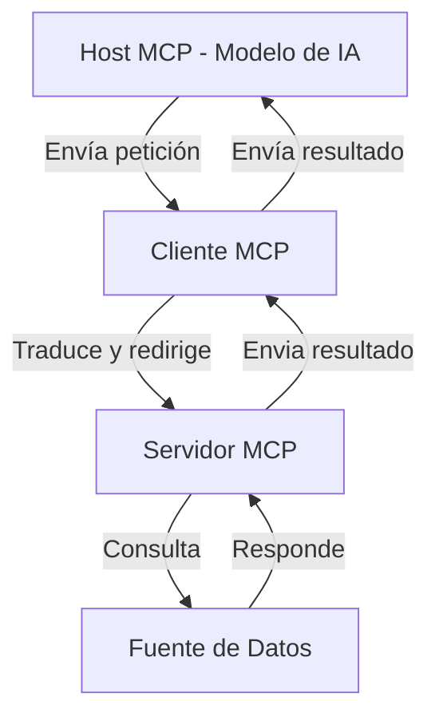

# Model Context Protocol (MCP): Elevando tus Agentes de IA a Nuevas Alturas

La inteligencia artificial (IA) ha avanzado significativamente en los últimos años, pero uno de los desafíos persistentes ha sido la integración eficiente de los modelos de IA con diversas fuentes de datos y herramientas externas. Aquí es donde entra en juego el **Model Context Protocol (MCP)**, un estándar abierto que está transformando la manera en que los agentes de IA interactúan con su entorno.

## ¿Qué es el Model Context Protocol (MCP)?

El MCP es un protocolo diseñado para estandarizar la comunicación entre modelos de IA y fuentes de datos externas, como bases de datos, APIs y otras herramientas. Su objetivo principal es eliminar la necesidad de integraciones personalizadas, permitiendo una interoperabilidad más fluida y reduciendo la complejidad en el desarrollo de soluciones de IA.

## Componentes Principales del MCP

La arquitectura del MCP se basa en una estructura cliente-servidor que incluye los siguientes componentes:

- **Hosts MCP**: Aplicaciones de IA que requieren acceso a datos a través del MCP.
- **Clientes MCP**: Interfaces que facilitan la comunicación entre los hosts y los servidores MCP.
- **Servidores MCP**: Programas que ofrecen acceso a datos y funcionalidades específicas mediante el protocolo estandarizado.
- **Fuentes de Datos**: Bases de datos, archivos y servicios que contienen la información relevante.

Esta estructura modular permite una integración más sencilla y escalable entre las aplicaciones de IA y diversas fuentes de datos y herramientas.

## Arquitectura del MCP

### El MCP sigue una arquitectura cliente-servidor que permite una separación clara de responsabilidades:

## Beneficios Clave del MCP

Implementar el MCP en sistemas de IA ofrece ventajas significativas:

1. **Acceso en Tiempo Real**: Los modelos de IA pueden consultar bases de datos y APIs en tiempo real, eliminando el problema de respuestas desactualizadas o dependientes de procesos de reindexación.

2. **Mayor Seguridad y Control**: Al no requerir almacenamiento intermedio de datos, el MCP reduce el riesgo de filtraciones y garantiza que la información sensible permanezca dentro del entorno empresarial o del usuario.

3. **Menor Carga Computacional**: A diferencia de otros sistemas que dependen de procesos computacionales intensivos, el MCP elimina esta necesidad, lo que puede traducirse en costos más bajos y mayor eficiencia.

4. **Flexibilidad y Escalabilidad**: El MCP permite conectar cualquier modelo de IA con diferentes sistemas sin requerir cambios estructurales, lo que lo hace ideal para empresas que trabajan con múltiples plataformas y bases de datos.

## Casos de Uso del MCP

El MCP tiene aplicaciones en diversos sectores:

- **Atención al Cliente**: Mejora la coherencia y precisión de las respuestas de los chatbots al acceder a información actualizada en tiempo real.

- **Automatización de Procesos Empresariales**: Facilita la integración de sistemas internos, optimizando flujos de trabajo y reduciendo la intervención manual.

- **Marketing Digital**: Permite una personalización más efectiva de las campañas al integrar datos de diversas fuentes sobre el comportamiento del consumidor.

## Cómo Empezar con el MCP

Para implementar el MCP, es necesario configurar un servidor MCP y conectarlo con las fuentes de datos relevantes. Existen diferentes SDKs y herramientas disponibles que facilitan la integración con lenguajes como Python, Java y TypeScript. Además, se recomienda explorar soluciones preconstruidas y documentación en línea para comprender mejor su aplicación y ventajas.

## Otras empresas impulsando la evolución del acceso a contexto

Empresas líderes como Anthropic, OpenAI y Google DeepMind también están desarrollando enfoques para dar a sus modelos acceso a contexto externo de forma dinámica y segura.

Anthropic ha introducido los "artifacts" en su plataforma Claude, permitiendo a los usuarios generar resultados interactivos (como código, texto o documentos) que se pueden reutilizar y versionar, acercándose al paradigma de agentes que interactúan con herramientas y entornos en tiempo real.

OpenAI ha implementado el concepto de "function calling" y la integración con herramientas como navegadores, código, y bases de conocimiento mediante su API y ChatGPT Plus. Aunque no siguen el protocolo MCP directamente, estos enfoques buscan resolver el mismo problema: extender la capacidad del modelo más allá de su contexto original.

Google DeepMind explora el uso de agentes capaces de razonar sobre múltiples herramientas, y se ha centrado en estrategias como el uso de memoria a largo plazo y recuperación de información (RAG) para lograr un desempeño contextual superior.

Estas iniciativas refuerzan la importancia de estándares como MCP, que permiten conectar estos avances con entornos reales de producción.

## Recursos y Documentación

### 📚 Documentación Oficial del MCP
- 📄 [Especificación oficial de MCP](https://github.com/model-context-protocol/spec)
- 📦 [Repositorio de ejemplo en GitHub](https://github.com/model-context-protocol/examples)
- 📺 [Video explicativo del protocolo (YouTube)](https://www.youtube.com/watch?v=JiOP5nXfSPg)
- 📘 [Artículo original en Newline.co](https://www.newline.co/@zaoyang/mcp-explained-taking-your-ai-agents-to-new-heights--175272fb)

### 🧠 Recursos de Otras Empresas

#### Anthropic
- 📄 [Artifacts en Claude (Anthropic)](https://www.anthropic.com/index/artifacts)

#### OpenAI
- 📘 [Function Calling - Documentación oficial](https://platform.openai.com/docs/guides/function-calling)

## Conclusión

El Model Context Protocol (MCP) representa un avance significativo en la forma en que los modelos de IA interactúan con datos en tiempo real. Al eliminar la necesidad de integraciones personalizadas y procesos intermedios, el MCP ofrece una solución más eficiente, segura y escalable. A medida que la IA continúa evolucionando, protocolos como el MCP serán fundamentales para desbloquear todo el potencial de los agentes inteligentes en diversos ámbitos.

