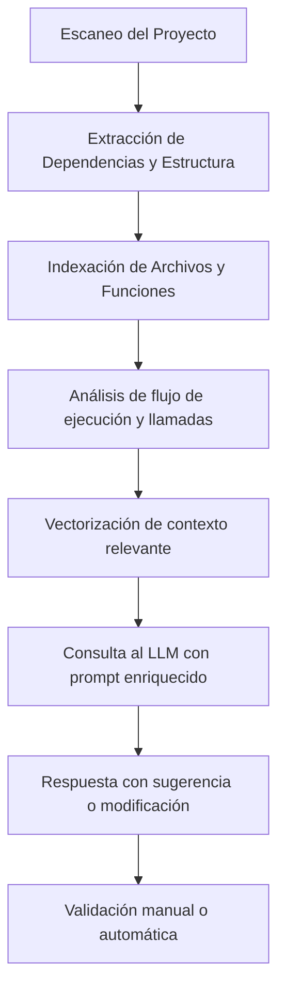

## 🧠 Asistentes de Código con Inteligencia Artificial

La programación moderna está experimentando una revolución silenciosa gracias a los **asistentes de código impulsados por IA**. Estas herramientas no solo sugieren líneas de código, sino que comprenden el contexto, ayudan a navegar grandes repositorios y automatizan tareas críticas como tests y refactorizaciones.

---

## ⚖️ Reparación y Generación Automática de Tests

Uno de los grandes beneficios es la **automatización de tests**:

- Detectan errores comunes antes de compilar.
- Proponen pruebas unitarias automáticamente.
- Corrigen tests rotos al detectar cambios en la lógica.

Esto es posible gracias al uso de modelos como GPT o Claude con aprendizaje reforzado y comprensión semántica del código.

---

## 🤝 Agentes Colaborativos de Código

Un **agente colaborativo de IA** puede actuar como parte activa del equipo:

1. Observa los cambios en el repo.
2. Sugiere mejoras o explica funciones.
3. Refactoriza código con justificaciones.

Herramientas como LangChain o AutoGen permiten orquestar agentes con roles distintos: documentación, refactorización, testing, etc.

---

## 🔍 Búsqueda y Descubrimiento de Agentes Especializados

Plataformas como **AutoGen** o **OpenDevin** permiten lanzar múltiples agentes, cada uno con su función:

- Agente para limpieza de código.
- Otro para interpretar errores.
- Otro más para explicar estructuras complejas.

Esto acelera el desarrollo y distribuye tareas inteligentes.

---

## 🧠 ¿Cómo comprenden el contexto sin conocer el negocio?

Una de las capacidades más impresionantes de los asistentes de código con IA es que pueden **comprender el contexto técnico completo de una aplicación sin saber su propósito de negocio**. ¿Cómo es posible esto?

- 📁 **Análisis estructural**: indexan todos los archivos del proyecto (código fuente, configuración, dependencias).
- 🔁 **Seguimiento de flujo de ejecución**: comprenden relaciones entre funciones, clases y llamadas entre módulos.
- 📄 **Lectura de documentación local**: aprovechan docstrings, comentarios, `README.md` y archivos de configuración para inferir funcionalidades.
- 🔍 **Modelo de razonamiento basado en patrones**: comparan tu código con miles de ejemplos conocidos para identificar buenas prácticas y posibles mejoras.

Aunque no conocen los objetivos del negocio, estos agentes operan con una lógica de programación universal, proponiendo refactorizaciones o mejoras seguras a nivel técnico. Estas recomendaciones pueden luego ser validadas por el desarrollador humano antes de aplicarse.

---

## 🔬 Profundizando: ¿Cómo lo hacen técnicamente?

Cuando los asistentes de código procesan un proyecto completo para entender su contexto, siguen una serie de pasos técnicos avanzados. A continuación, describimos un flujo generalizado:

### Componentes involucrados:

- **File Parser**: analiza archivos `.ts`, `.py`, `.go`, `.js`, `.java`, etc.
- **Dependency Mapper**: crea un mapa de relaciones entre módulos.
- **Semantic Embeddings**: convierte cada función o clase en vectores semánticos.
- **RAG (Retrieval-Augmented Generation)**: recupera solo el contexto necesario antes de cada sugerencia.
- **LLM Orquestado**: se le entrega un prompt que incluye descripción del archivo, dependencias y código objetivo.

---

## 🔐 Consideraciones de Seguridad: ¿Qué debes proteger?

Es fundamental tener en cuenta aspectos de seguridad antes de usar asistentes de IA sobre tu código, especialmente si acceden a información sensible o privada.

### Buenas prácticas para proteger tu código:

- 🔒 **Desensibilizar datos antes de enviar al modelo**:
  - Reemplazar claves API o tokens con placeholders (`API_KEY` → `***`)
  - Evitar enviar `.env`, `secrets.yaml` o archivos `.pem`

- 🧱 **Filtrado de contexto**:
  - Implementar una capa previa que determine qué archivos o funciones deben excluirse del análisis.

- 📜 **Reglas de anotación manual o automática**:
  - Añadir etiquetas como `// @private`, `# NO_AI` para excluir líneas del contexto compartido.

- 🌐 **Uso de modelos locales o edge (Ollama, Mistral local)**:
  - En lugar de enviar el código a servicios externos, usar modelos alojados en entornos controlados.

- 🧑‍💻 **Auditoría y registro de prompts y respuestas**:
  - Para saber qué se compartió, cómo se interpretó y cuál fue la recomendación.

Estas medidas permiten aprovechar el poder de los asistentes con IA sin comprometer datos confidenciales de clientes, arquitectura o procesos de negocio.

---

## 🧰 Integración con MCP y Flujos Multimodelo

Gracias al protocolo **MCP (Multi-Component Programming)**, estas herramientas pueden integrarse en flujos distribuidos que:

- Ejecutan agentes con distintos LLMs (como GPT, Claude, Mistral u Ollama).
- Permiten que cada agente llame a una función o modelo especializado.
- Mantienen trazabilidad del razonamiento y contexto entre llamadas.

🔗 Ejemplo práctico: un agente principal analiza código, otro genera tests con GPT-4, otro verifica sintaxis con Llama 3 y finalmente uno explica resultados al usuario con una interfaz.

---

## 🧩 Comprensión de Grandes Bases de Código

Gracias a la IA:

- Se generan mapas conceptuales de módulos.
- Se detecta deuda técnica o duplicaciones.
- Se explican funciones complejas en lenguaje natural.

Esto reduce el tiempo de onboarding y mejora la mantenibilidad.

---

## 🌊 Windsurf: IDE con IA y Comandos Naturales

**Windsurf**, de Codeium, integra IA para una experiencia de desarrollo inmersiva:

- ✏️ **Command** (`Cmd+I`): ejecutar comandos en lenguaje natural como "agrega test para esta función" o "optimiza este bloque".
- 🌍 **Cascade**: motor contextual que entiende todo el repo y mantiene el estado entre interacciones.
- 🔹 **Code Lenses**: acciones sugeridas para explicar, refactorizar y documentar funciones.
- 🛠️ **Auto-run**: ejecución de acciones inteligentes como pruebas, instalación de dependencias o despliegues.

📚 Más info: [docs.windsurf.com](https://docs.windsurf.com/command/windsurf-overview?utm_source=chatgpt)

---

## 🖱️ Cursor: Un VSCode Potenciado con IA

**Cursor** es una versión modificada de VSCode con funciones IA avanzadas:

- Genera y reescribe código en lenguaje natural.
- Ofrece autocompletado y predicción de cambios.
- Entiende toda la base de código y responde consultas sobre ella.
- Compatible con extensiones y atajos de teclado de VSCode.

🔗 Página oficial: [https://www.cursor.so](https://www.cursor.so)

---

## 🤖 Copilot: El Compañero IA para Desarrolladores

**GitHub Copilot**, creado por GitHub y OpenAI, permite:

- Autocompletado en tiempo real basado en comentarios y contexto.
- Sugerencias para múltiples lenguajes.
- Integración con VSCode, JetBrains, Neovim.

📎 Enlace: [https://github.com/features/copilot](https://github.com/features/copilot)

Beneficios:

- ✅ Aumenta la productividad.
- ✅ Mejora la calidad del código.
- ✅ Facilita el aprendizaje de buenas prácticas.

---

## 🚀 Conclusión

Los asistentes de código con IA como **Windsurf**, **Cursor** y **Copilot** están cambiando radicalmente cómo programamos. No solo escribimos más rápido: entendemos mejor, automatizamos más, y colaboramos con agentes virtuales.

Gracias a integraciones con **MCP** y flujos multi-LLM, ahora podemos construir sistemas verdaderamente inteligentes, distribuidos y escalables.

¡El futuro del desarrollo ya está aquí!

---

💬 Si te interesa implementar estas herramientas en tu flujo de trabajo, conversemos en [codeia.cl](https://codeia.cl)

