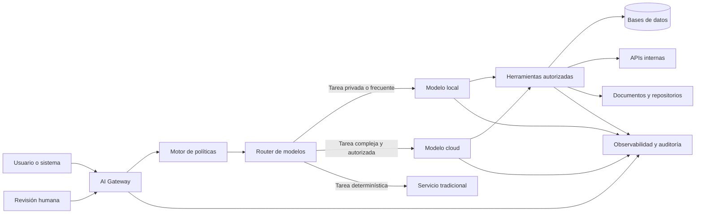
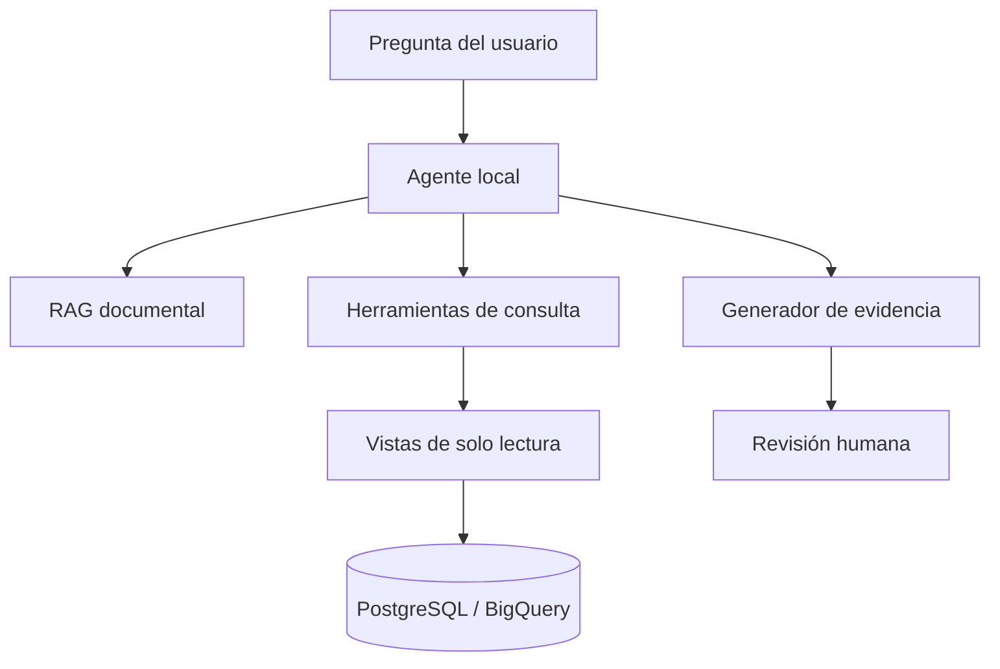
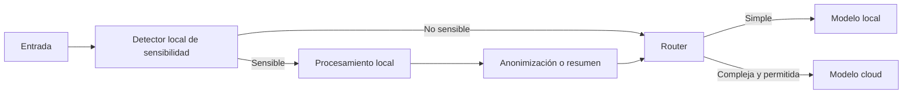

Durante los últimos días estuve revisando pruebas de inteligencia artificial ejecutada completamente en local: modelos abiertos corriendo sobre una RTX 5090, agentes de programación conectados a editores, flujos multimodales, estaciones con memoria unificada y equipos especializados como NVIDIA DGX Spark.

A primera vista, lo más llamativo son los números: cientos de tokens por segundo, modelos con decenas o cientos de miles de millones de parámetros y computadores de escritorio capaces de realizar tareas que hace pocos años parecían reservadas para un centro de datos.

Sin embargo, después de mirar estas pruebas con más atención, llegué a una conclusión distinta.

El cambio importante no es que ahora podamos tener un “ChatGPT privado” en el escritorio. El cambio importante es que **la inteligencia artificial está comenzando a transformarse en una nueva capa de infraestructura de software**.

Eso significa que una empresa podrá decidir dónde ejecutar un modelo, qué datos puede utilizar, qué herramientas tiene permitido invocar, cuánto contexto recibe, cómo se evalúan sus respuestas y cuándo una tarea debe escalarse a un modelo más potente en la nube.

La pregunta, por tanto, deja de ser:

> ¿Qué modelo es el más inteligente?

Y comienza a ser:

> ¿Cómo diseño un sistema que combine modelos, datos, herramientas, seguridad, costos y conocimiento del negocio para resolver un problema real?

Para mí, esta pregunta también tiene una dimensión personal. A mis 44 años, con experiencia en backend, microservicios, cloud, BigQuery, PostgreSQL, procesos de provisiones e integración con sistemas financieros, no me interesa competir solamente por escribir código más rápido que un agente.

Me interesa avanzar hacia una posición distinta: **diseñar, integrar y operar sistemas de IA empresariales**, especialmente en procesos donde la privacidad, la trazabilidad y la exactitud importan.

---

## La señal detrás de un computador de US$5.000

Un computador preparado para IA local todavía puede costar varios miles de dólares. Una estación con una GPU de gama alta, suficiente memoria, almacenamiento rápido, refrigeración y una fuente de poder adecuada puede superar con facilidad el costo de un computador convencional.

Eso puede parecer prohibitivo. Pero también recuerda lo rápido que cambia la economía del hardware.

Hubo una época en que disponer de servidores, almacenamiento masivo, procesamiento gráfico o infraestructura de alta disponibilidad estaba fuera del alcance de una persona o de un equipo pequeño. Con el tiempo, esas capacidades bajaron de precio, se estandarizaron y terminaron formando parte del trabajo cotidiano.

Es razonable pensar que algo parecido ocurrirá con la inferencia de inteligencia artificial.

Los modelos serán más eficientes. Las cuantizaciones mejorarán. El hardware incorporará aceleradores especializados. Los sistemas operativos y herramientas abstraerán una parte creciente de la complejidad. Una capacidad que hoy exige una estación de varios miles de dólares podría convertirse mañana en una función normal de un computador profesional.

NVIDIA DGX Spark es una señal clara de esta transición. El equipo incorpora 128 GB de memoria unificada y está diseñado para trabajar localmente con modelos de hasta 200 mil millones de parámetros, además de permitir el desarrollo, prototipado y ajuste de aplicaciones de IA en un formato de escritorio.[^1]

Pero el dato relevante no es solamente cuántos parámetros puede cargar.

El dato relevante es que estamos viendo aparecer una nueva categoría de computador: **la estación personal de IA**.

Así como un desarrollador puede tener hoy una base de datos, contenedores, colas, servicios web y entornos completos en su máquina, en el futuro también podrá tener uno o varios modelos especializados funcionando como servicios internos.

---

## Qué significa realmente ejecutar IA en local

Ejecutar un modelo en local significa que la inferencia ocurre en una máquina controlada por la persona o la organización. El prompt, los documentos recuperados, el contexto y la respuesta pueden permanecer dentro del computador o de la red privada.

Esto no implica necesariamente que el sistema esté aislado de internet. Una arquitectura local puede seguir consultando APIs, bases de datos o servicios externos. La diferencia es que la organización controla qué información sale y qué procesamiento permanece dentro de su infraestructura.

En la práctica, la IA local puede desplegarse en distintos niveles:

1. **En el computador del usuario**, usando herramientas como LM Studio u Ollama.
2. **En una estación de trabajo compartida**, accesible desde varios equipos de una red.
3. **En un servidor interno**, con GPUs dedicadas y un motor de inferencia.
4. **En infraestructura edge**, cerca del lugar donde se generan los datos.
5. **En un entorno híbrido**, usando modelos locales para ciertas tareas y modelos cloud para otras.

LM Studio permite exponer modelos locales mediante APIs compatibles con interfaces de OpenAI y Anthropic. Ollama también ofrece una API local y compatibilidad con herramientas y clientes existentes. Para cargas concurrentes o despliegues más cercanos a producción, motores como vLLM permiten servir modelos mediante una API compatible con OpenAI.[^2][^3][^4]

Esta compatibilidad es más importante de lo que parece.

Permite diseñar una aplicación contra una interfaz común y cambiar el proveedor o el lugar de ejecución sin reconstruir toda la solución. Un servicio puede apuntar inicialmente a un modelo local y, cuando una tarea excede sus capacidades, enviar la solicitud a un modelo cloud.

La IA local deja así de ser una aplicación aislada y pasa a comportarse como **un servicio más dentro de la arquitectura**.

---

## Lo que la IA local no es

La IA local suele presentarse de manera demasiado simplificada. Hay varias ideas que conviene separar.

### No es automáticamente más barata

Comprar hardware elimina parte del costo variable por token, pero introduce otros costos:

- adquisición del equipo;
- consumo eléctrico;
- refrigeración;
- mantenimiento;
- almacenamiento;
- configuración;
- actualizaciones;
- tiempo operacional;
- capacidad ociosa;
- reemplazo del hardware.

Para una persona que usa IA ocasionalmente, una suscripción o una API puede ser económicamente superior. El hardware local comienza a justificarse cuando existe uso constante, grandes volúmenes, restricciones de privacidad o necesidad de control.

### No es automáticamente más privada

El modelo puede ejecutarse en local y aun así existir filtración de información mediante:

- telemetría;
- plugins;
- herramientas con acceso a internet;
- repositorios mal configurados;
- logs sin protección;
- endpoints expuestos en la red;
- permisos excesivos;
- dependencias comprometidas.

La privacidad no aparece solo por instalar un modelo. Debe diseñarse.

### No reemplaza siempre a los modelos de frontera

Un modelo local pequeño o mediano puede resolver una gran cantidad de tareas, pero los modelos cloud más avanzados seguirán teniendo ventajas en razonamiento complejo, contexto, multimodalidad, uso de herramientas y estabilidad.

La arquitectura adecuada no consiste en obligar a que todo sea local. Consiste en utilizar el recurso apropiado para cada tarea.

### No elimina la ingeniería de software

Un agente puede producir código rápidamente, pero no conoce por sí solo la historia del sistema, las restricciones de negocio, la deuda técnica, los riesgos regulatorios ni las consecuencias de una decisión incorrecta.

La velocidad de generación no reemplaza la responsabilidad.

---

## El error de elegir primero el hardware

Una de las ideas más valiosas de las pruebas que revisé es que **no tiene sentido comprar primero la máquina y decidir después qué ejecutar**.

La secuencia correcta es la contraria:

1. Definir el problema.
2. Identificar las tareas que realizará el modelo.
3. Elegir modelos candidatos.
4. Medir su calidad.
5. Determinar contexto, concurrencia y latencia.
6. Calcular memoria y almacenamiento.
7. Recién entonces seleccionar el hardware.

Un modelo para autocompletado de código no tiene los mismos requisitos que uno para analizar un repositorio completo. Un modelo para clasificación masiva no necesita necesariamente la misma calidad que uno que debe proponer una arquitectura. Un generador de imágenes tampoco utiliza los recursos de la misma forma que un modelo de lenguaje.

Comprar una GPU por entusiasmo puede terminar en dos problemas opuestos:

- una máquina costosa y subutilizada;
- una máquina que no soporta el modelo, contexto o concurrencia necesarios.

El hardware debe responder a una carga real, no a una promesa de marketing.

---

## Los conceptos técnicos que importan

No es necesario ser especialista en diseño de chips para trabajar con IA local, pero sí conviene comprender algunos conceptos básicos.

### 1. Tamaño del modelo

Los nombres 7B, 14B, 32B o 70B indican aproximadamente la cantidad de parámetros del modelo.

Un modelo mayor suele requerir más memoria y más tiempo de inferencia. Sin embargo, más parámetros no significan automáticamente mejor rendimiento en todas las tareas.

Un modelo más pequeño, reciente y especializado puede superar a uno mayor y antiguo en programación, clasificación, extracción o uso de herramientas.

La selección debe hacerse mediante evaluaciones sobre el caso de uso real.

### 2. Cuantización

La cuantización reduce la precisión numérica utilizada para representar los pesos del modelo. Esto permite disminuir el tamaño en memoria y, en muchos casos, acelerar la inferencia.

La ventaja es evidente: un modelo que no cabría en una GPU puede llegar a ejecutarse en una configuración más pequeña.

La desventaja es que una cuantización agresiva puede reducir calidad, estabilidad o precisión. El impacto depende del modelo y de la tarea.

No existe una regla universal. Hay que medir.

### 3. VRAM y memoria unificada

En una GPU dedicada, los pesos del modelo se cargan principalmente en la memoria de video o VRAM.

Si el modelo, su caché y el contexto no caben, parte del trabajo puede desplazarse a memoria del sistema o CPU, reduciendo mucho el rendimiento.

Las arquitecturas con memoria unificada —como ciertos equipos Apple o DGX Spark— permiten que CPU y GPU compartan un bloque de memoria más grande. Esto facilita cargar modelos de mayor tamaño sin utilizar múltiples tarjetas.

Pero capacidad no es igual a velocidad.

### 4. Ancho de banda de memoria

Durante la generación de texto, el sistema necesita leer continuamente los pesos del modelo. Por esa razón, el ancho de banda de memoria tiene una influencia significativa sobre la cantidad de tokens generados por segundo.

Una máquina puede tener mucha memoria y permitir cargar un modelo grande, pero responder lentamente.

Otra puede tener menos memoria, pero generar tokens con mucha rapidez.

Este es uno de los principales trade-offs actuales:

- **mucha memoria**, para cargar modelos grandes;
- **alto ancho de banda**, para generar más rápido;
- **alto costo**, cuando se necesitan ambas cosas.

DGX Spark, por ejemplo, combina 128 GB de memoria unificada con un ancho de banda indicado por NVIDIA de 273 GB/s.[^5] Eso lo hace atractivo para prototipado, experimentación y determinadas cargas, pero no significa que cada modelo quepa y funcione a la velocidad esperada por el usuario.

### 5. Contexto y KV cache

El modelo no consume memoria solamente por sus pesos.

También necesita memoria para procesar:

- el system prompt;
- la conversación;
- archivos;
- resultados de herramientas;
- documentación recuperada;
- historial de decisiones.

Los agentes de programación pueden utilizar contextos extensos porque incluyen instrucciones, estructura del repositorio, diffs, errores, pruebas y archivos relacionados.

Por eso, que un modelo apenas quepa en memoria no garantiza que pueda trabajar con un contexto útil.

### 6. Concurrencia

No es lo mismo atender a una persona que ejecutar veinte agentes o procesar cientos de documentos.

En un chat individual interesa principalmente la latencia percibida. En una carga por lotes importa más el throughput total.

Una máquina que parece lenta respondiendo una conversación puede ser útil procesando múltiples solicitudes concurrentes, siempre que el motor de inferencia y el modelo estén configurados para ello.

### 7. Tiempo hasta el primer token

Los tokens por segundo no muestran toda la experiencia.

También importa cuánto tarda el sistema en:

- cargar el modelo;
- procesar el prompt;
- recuperar documentos;
- preparar herramientas;
- comenzar a responder.

Para desarrollo de software, el tiempo hasta el primer token puede ser tan importante como la velocidad de generación.

---

## Local, cloud o híbrido

La discusión no debería plantearse como una guerra entre local y cloud.

Cada alternativa tiene fortalezas diferentes.

| Criterio | IA local | IA cloud | Arquitectura híbrida |
|---|---|---|---|
| Privacidad | Alto control si está bien configurada | Depende del proveedor y contrato | Los datos sensibles pueden permanecer localmente |
| Calidad máxima | Limitada por modelo y hardware disponibles | Acceso a modelos de frontera | Se escala solo cuando es necesario |
| Costo inicial | Alto | Bajo | Medio |
| Costo variable | Bajo después de comprar el hardware | Pago por uso o suscripción | Optimizable por routing |
| Escalabilidad | Limitada por capacidad propia | Alta | Flexible |
| Operación | Responsabilidad interna | Gestionada por proveedor | Compartida |
| Trabajo offline | Posible | Generalmente no | Parcial |
| Actualización de modelos | Manual | Administrada | Selectiva |
| Personalización | Alta | Depende de la plataforma | Alta |
| Tiempo de implementación | Mayor | Menor | Intermedio |

Mi conclusión es que la mayoría de las organizaciones no terminará eligiendo un único enfoque.

La arquitectura dominante probablemente será híbrida.

Un modelo local pequeño o mediano podrá encargarse de tareas frecuentes, privadas y predecibles. Un modelo cloud podrá resolver las tareas complejas que requieren mayor capacidad.

---

## Una arquitectura híbrida de referencia

La siguiente arquitectura representa cómo imagino un sistema empresarial de IA que combine inferencia local y cloud.



### AI Gateway

Actúa como punto de entrada común. Centraliza autenticación, límites, logging y compatibilidad de APIs.

### Motor de políticas

Determina qué datos pueden enviarse a cada modelo y qué herramientas están permitidas.

Puede aplicar reglas como:

- este repositorio no puede salir de la red;
- esta consulta contiene datos personales;
- este usuario solo puede leer;
- esta acción requiere aprobación;
- esta respuesta debe incluir evidencia.

### Router de modelos

Selecciona el modelo según:

- sensibilidad;
- dificultad;
- costo;
- latencia;
- idioma;
- tamaño del contexto;
- necesidad de herramientas;
- nivel de riesgo.

### Herramientas autorizadas

El modelo no debería tener acceso irrestricto al sistema operativo o a todas las bases de datos.

Cada herramienta debe exponer una capacidad limitada y auditable.

Ejemplos:

- consultar una vista de inventario;
- leer documentación;
- ejecutar pruebas;
- crear una rama;
- obtener logs;
- generar un reporte;
- preparar una propuesta de cambio.

### Observabilidad y auditoría

Un sistema empresarial necesita registrar:

- modelo utilizado;
- versión;
- prompt o hash del prompt;
- documentos recuperados;
- herramientas invocadas;
- latencia;
- costo;
- resultado;
- evaluación;
- aprobación humana;
- errores.

Sin trazabilidad, un agente puede convertirse en una caja negra difícil de operar.

---

## Casos de uso que tienen sentido para mi experiencia

El valor de la IA local no está en ejecutar un modelo por curiosidad. Está en conectar esa capacidad con problemas concretos.

En mi caso, veo al menos siete líneas de aplicación.

---

### 1. Agente privado para repositorios Go y microservicios

Trabajo con servicios backend, integraciones, bases de datos y procesos que no deberían exponerse libremente.

Un agente local podría indexar:

- repositorios Go;
- contratos de API;
- documentación;
- diagramas;
- modelos de datos;
- consultas SQL;
- decisiones de arquitectura;
- historial de incidencias;
- convenciones internas.

A partir de ese contexto podría:

- explicar el flujo completo de una operación;
- encontrar duplicación entre microservicios;
- identificar dependencias;
- proponer pruebas;
- generar documentación;
- detectar errores de manejo;
- preparar refactors;
- revisar contratos;
- construir una primera implementación en una rama aislada.

La diferencia con un chatbot genérico sería que el agente trabajaría sobre el conocimiento real del sistema y dentro de un perímetro controlado.

#### Límites necesarios

No le entregaría acceso directo a producción.

El flujo debería ser:

1. lectura;
2. análisis;
3. propuesta;
4. cambio en rama;
5. ejecución de pruebas;
6. reporte de evidencia;
7. revisión humana;
8. despliegue mediante el pipeline normal.

La autonomía debe aumentar solo después de demostrar confiabilidad.

---

### 2. Asistente para provisiones y procesos financieros

Este es probablemente el caso con mayor diferenciación profesional.

Los procesos de provisiones combinan:

- reglas contables;
- datos de inventario;
- movimientos;
- jerarquías de producto;
- parámetros por país;
- exclusiones;
- integraciones con SAP;
- cierres mensuales;
- validaciones UAT;
- trazabilidad histórica.

Un asistente privado podría conectarse a la documentación, las reglas, los parámetros y los resultados para responder preguntas como:

- ¿Por qué este producto fue clasificado como obsoleto?
- ¿Qué regla produjo este monto?
- ¿Qué cambió entre UAT y producción?
- ¿Qué exclusión se aplicó?
- ¿Cuál fue el último movimiento relevante?
- ¿Qué diferencias existen entre dos países?
- ¿Qué registros explican una variación?
- ¿Qué evidencia debería incluirse para auditoría?

El modelo no debería calcular por sí solo el valor financiero final. El cálculo debe mantenerse en servicios determinísticos y reproducibles.

La IA puede actuar como una capa de explicación, navegación, análisis y asistencia.

#### Patrón recomendado



El modelo consulta, recupera y explica. Las reglas de cálculo permanecen en código y SQL versionado.

Esto protege una separación fundamental:

> La IA puede interpretar el proceso, pero el sistema financiero debe seguir siendo verificable.

---

### 3. Asistente de reconciliación y auditoría

Una tarea repetitiva en sistemas financieros es comparar fuentes y encontrar diferencias.

Un flujo local podría:

1. recibir reportes de dos sistemas;
2. normalizar formatos;
3. identificar diferencias;
4. agruparlas por causa probable;
5. relacionarlas con reglas conocidas;
6. generar un borrador de análisis;
7. adjuntar evidencia;
8. dejar la decisión final a una persona.

La IA es útil para organizar y explicar excepciones. No debería inventar una justificación cuando no existe evidencia.

Para evitarlo, cada afirmación debería vincularse con:

- consulta ejecutada;
- documento;
- registro;
- regla;
- parámetro;
- fecha;
- versión del proceso.

---

### 4. Gateway de privacidad antes de utilizar la nube

No todo debe resolverse con un modelo local.

Una alternativa más eficiente es utilizarlo como primera capa.

El modelo local puede:

- detectar información sensible;
- anonimizar nombres e identificadores;
- eliminar secretos;
- resumir grandes contextos;
- clasificar la complejidad;
- decidir si la tarea requiere cloud;
- bloquear solicitudes no autorizadas.

Después, solamente el contenido mínimo y permitido se envía al modelo externo.



Este patrón permite combinar privacidad, costo y calidad.

---

### 5. Procesamiento por lotes

Una estación de IA no tiene que utilizarse solamente como chat.

Puede trabajar continuamente en segundo plano sobre tareas como:

- clasificación de documentos;
- generación de embeddings;
- resumen de reportes;
- análisis de logs;
- detección de patrones en incidencias;
- etiquetado de tickets;
- revisión de repositorios;
- generación inicial de pruebas;
- actualización de documentación;
- evaluación de outputs de otros agentes.

En estas cargas, la latencia de una respuesta individual es menos importante que el volumen total procesado.

También se aprovecha mejor una inversión de hardware que permanecería ociosa gran parte del día.

---

### 6. Laboratorio para agentes y skills

Estoy trabajando en ideas relacionadas con un marketplace de assets, agentes y skills.

La IA local podría convertirse en un laboratorio de compatibilidad.

Cada skill podría evaluarse contra varios modelos para registrar:

- capacidad de seguir instrucciones;
- precisión de tool calling;
- contexto mínimo;
- consumo de memoria;
- latencia;
- porcentaje de éxito;
- errores frecuentes;
- necesidad de modelo cloud;
- permisos requeridos;
- riesgos de seguridad.

El marketplace dejaría de ofrecer solamente archivos o prompts.

Podría ofrecer **evidencia operacional**:

> Esta skill funciona correctamente con determinados modelos, requiere cierto contexto, invoca estas herramientas y alcanzó este porcentaje de éxito en un conjunto de pruebas.

Eso crea una capa de confianza que hoy falta en muchos ecosistemas de agentes.

---

### 7. Sistema personal de conocimiento

También existe un uso individual con valor real.

Un modelo local podría trabajar con mi:

- diario;
- vault de Obsidian;
- documentación de proyectos;
- publicaciones;
- certificaciones;
- métricas;
- decisiones;
- ideas de negocio;
- planificación profesional.

Podría ayudar a:

- encontrar patrones;
- identificar compromisos incumplidos;
- resumir progreso;
- conectar ideas antiguas;
- preparar borradores;
- detectar proyectos abandonados;
- mantener consistencia entre publicaciones.

En este caso, la privacidad es importante porque el contenido puede incluir reflexiones personales, decisiones profesionales y datos que no conviene enviar indiscriminadamente a servicios externos.

---

## Cómo trabajar con agentes locales para desarrollar software

Una de las conclusiones más relevantes de las pruebas revisadas es que un modelo local puede construir software útil, pero no mediante un único prompt gigantesco.

El desarrollo asistido por agentes sigue funcionando mejor como un proceso iterativo.

### El flujo que considero correcto

#### 1. Definir el problema

Antes de generar código hay que aclarar:

- objetivo;
- usuarios;
- restricciones;
- criterios de aceptación;
- dependencias;
- riesgos;
- componentes que no deben modificarse.

#### 2. Crear una especificación

La especificación debe transformar una idea ambigua en decisiones verificables.

Puede incluir:

- arquitectura;
- estructura de carpetas;
- contratos;
- modelo de datos;
- flujos;
- errores;
- pruebas;
- requisitos no funcionales.

#### 3. Dividir en fases pequeñas

Cada fase debe producir algo observable.

Por ejemplo:

1. inicialización;
2. dominio;
3. persistencia;
4. API;
5. integración;
6. pruebas;
7. observabilidad;
8. documentación.

#### 4. Establecer puntos de control

Después de cada fase:

- compilar;
- ejecutar pruebas;
- revisar diff;
- validar arquitectura;
- comprobar criterios;
- hacer commit.

#### 5. Utilizar el modelo como implementador dirigido

El agente puede escribir código, pero una persona debe decidir:

- qué cambio se acepta;
- qué simplificación es válida;
- qué deuda se introduce;
- qué riesgo existe;
- cuándo detener la implementación.

#### 6. Mantener contexto durable

Cuando el contexto de una conversación crece demasiado, conviene materializar el estado en archivos:

- `SPEC.md`;
- `DECISIONS.md`;
- `TASKS.md`;
- `TEST_RESULTS.md`;
- `KNOWN_ISSUES.md`.

Así, otro modelo o una nueva sesión puede continuar sin depender de todo el historial del chat.

### Por qué evitar el “one shot”

Una implementación grande en una única ejecución puede acumular un error arquitectónico desde el inicio.

Cuanto más avanza el agente, más costoso resulta corregirlo.

El problema no es solamente el consumo de tokens. Es el tiempo perdido revisando una solución construida sobre una decisión incorrecta.

Los agentes no eliminan la necesidad de una metodología. La hacen más importante.

---

## La seguridad debe formar parte del diseño

Un agente con acceso a herramientas no es solamente un generador de texto. Es una identidad con capacidad de actuar.

Por eso, un sistema local debe incorporar controles similares a los de cualquier plataforma empresarial.

### Principios mínimos

#### Menor privilegio

Cada agente recibe únicamente las herramientas necesarias.

#### Separación de lectura y escritura

Consultar información no debe implicar permiso para modificarla.

#### Entornos aislados

Los cambios de código deben ejecutarse en ramas, worktrees, contenedores o sandboxes.

#### Secretos fuera del contexto

Claves y credenciales no deben incorporarse directamente al prompt.

#### Aprobación para acciones críticas

Despliegues, pagos, modificaciones de datos y operaciones irreversibles requieren aprobación explícita.

#### Registro de herramientas

Cada llamada debe quedar registrada con sus parámetros y resultado.

#### Defensa contra prompt injection

Los documentos recuperados pueden contener instrucciones maliciosas. El sistema debe distinguir datos de instrucciones autorizadas.

#### Evaluación continua

Un cambio de modelo, cuantización o prompt puede alterar el comportamiento. Las pruebas deben ejecutarse nuevamente.

---

## Qué estudiar en esta transición

La aparición de IA local no significa que tenga que convertirme en investigador de modelos fundacionales.

Mi objetivo debería ser desarrollar una combinación difícil de reemplazar:

> Sistemas distribuidos + cloud + IA aplicada + datos + procesos financieros + seguridad.

A mis 44 años, la estrategia correcta no es reiniciar mi carrera desde cero. Es construir capas sobre la experiencia acumulada.

### 1. Inferencia y serving

Aprender:

- Ollama;
- LM Studio;
- llama.cpp;
- vLLM;
- formatos y cuantización;
- context windows;
- batching;
- concurrencia;
- métricas de latencia;
- gestión de modelos.

### 2. AI Platform Engineering

Profundizar en:

- AI gateways;
- model routing;
- fallback;
- rate limits;
- caché;
- observabilidad;
- evaluación;
- gestión de prompts;
- control de versiones;
- costos;
- despliegue híbrido.

### 3. Agentes empresariales

Estudiar:

- tool calling;
- MCP;
- permisos;
- human-in-the-loop;
- planificación;
- memoria;
- recuperación;
- flujos multiagente;
- idempotencia;
- compensaciones;
- manejo de errores.

### 4. Datos y RAG

Trabajar con:

- embeddings;
- búsqueda híbrida;
- reranking;
- chunking;
- metadatos;
- linaje;
- calidad de datos;
- autorización por documento;
- evaluación de recuperación.

### 5. Sistemas distribuidos

Mantener como base:

- eventos;
- consistencia;
- sagas;
- reintentos;
- circuit breakers;
- observabilidad;
- seguridad;
- diseño de APIs;
- procesamiento batch y streaming.

### 6. Dominio financiero

Convertir la experiencia práctica en especialización:

- provisiones;
- reconciliación;
- cierres;
- auditoría;
- controles;
- trazabilidad;
- integraciones ERP;
- segregación de funciones.

### 7. Inglés y comunicación

El inglés sigue siendo una restricción importante para acceder a documentación, equipos internacionales y cargos remotos.

La IA puede ayudar a traducir, pero no reemplaza la capacidad de defender una arquitectura, explicar un riesgo o participar en una reunión técnica.

---

## Qué construir antes de comprar hardware costoso

No compraría inmediatamente una estación de US$5.000.

Primero demostraría que existe una carga que la justifica.

Mi Mac mini M4 es suficiente para diseñar y validar una primera plataforma.

### Prototipo 1: servidor local de modelos

Objetivo:

- instalar Ollama o LM Studio;
- exponer una API local;
- probar modelos pequeños;
- medir tokens por segundo;
- medir tiempo hasta el primer token;
- registrar memoria y contexto.

### Prototipo 2: RAG privado

Objetivo:

- indexar documentación no sensible o ficticia;
- crear embeddings;
- recuperar fuentes;
- exigir citas;
- medir precisión;
- detectar preguntas sin respuesta.

### Prototipo 3: agente de repositorio

Objetivo:

- trabajar sobre un repositorio personal;
- permitir solo lectura inicialmente;
- generar una especificación;
- proponer cambios;
- ejecutar pruebas en sandbox;
- comparar contra un modelo cloud.

### Prototipo 4: router híbrido

Objetivo:

- clasificar tareas;
- enviar las simples al modelo local;
- escalar las complejas a cloud;
- registrar costo, latencia y calidad.

### Prototipo 5: evaluación

Crear un conjunto estable de pruebas:

- comprensión de código;
- generación de tests;
- tool calling;
- extracción estructurada;
- explicación de reglas;
- resistencia a instrucciones maliciosas;
- consistencia.

Sin evaluación, la comparación entre modelos termina basada en impresiones.

---

## Cuándo tendría sentido comprar una estación más potente

Consideraría una inversión mayor solamente si se cumplen varias de estas condiciones:

- utilizo modelos locales todos los días;
- la memoria actual limita tareas reales;
- proceso grandes volúmenes;
- necesito trabajar con código o datos privados;
- el costo mensual cloud es significativo;
- quiero servir modelos a varias personas;
- necesito ejecutar varios agentes simultáneamente;
- tengo métricas que demuestran el beneficio;
- existe un proyecto comercial asociado;
- la máquina puede producir ingresos o reducir costos.

También calcularía el costo total:

```text
Costo total anual =
  depreciación del hardware
  + electricidad
  + mantenimiento
  + almacenamiento
  + tiempo operacional
  + costo de oportunidad
```

Luego lo compararía con:

```text
Costo cloud anual =
  suscripciones
  + consumo por API
  + alquiler de GPU
  + almacenamiento
  + transferencia
```

La decisión debe basarse en uso y retorno, no en entusiasmo.

---

## Los principales riesgos de la IA local

### Obsolescencia rápida

Una máquina costosa puede quedar atrás en pocos años.

### Fragmentación

Distintos modelos utilizan plantillas, formatos y capacidades diferentes.

### Calidad variable

Los benchmarks no siempre representan el comportamiento en el problema real.

### Complejidad operacional

Drivers, runtimes, cuantizaciones y dependencias pueden consumir tiempo.

### Falsa sensación de privacidad

Un endpoint mal expuesto puede anular el beneficio de ejecutar localmente.

### Falta de gobernanza

Sin permisos y auditoría, un agente privado también puede causar daño.

### Sobreautomatización

No todo proceso debe transformarse en un agente. Muchas tareas se resuelven mejor con código determinístico.

### Confusión entre “cabe” y “funciona bien”

La memoria suficiente permite cargar el modelo. No garantiza latencia, contexto, concurrencia ni calidad aceptables.

---

## Mi posición profesional frente a este cambio

El avance de la IA me hace pensar que una parte creciente de la programación rutinaria será absorbida por modelos y agentes.

Eso no significa que el software desaparezca.

Significa que cambiará el lugar donde se concentra el valor.

El valor se desplazará desde:

- escribir cada línea manualmente;
- memorizar sintaxis;
- implementar CRUD repetitivo;
- dominar un framework aislado;

hacia:

- definir problemas;
- diseñar sistemas;
- integrar modelos;
- evaluar resultados;
- controlar permisos;
- operar plataformas;
- comprender el negocio;
- responder por producción.

A los 44 años, mi ventaja no debería ser competir con un desarrollador más joven o con un modelo en velocidad de escritura.

Mi ventaja debería ser combinar:

- experiencia productiva;
- criterio técnico;
- conocimiento financiero;
- arquitectura;
- cloud;
- IA;
- trazabilidad;
- comunicación.

La posición que busco no es “operador de prompts”.

Es una evolución desde backend hacia **AI Systems Engineer, AI Platform Engineer o arquitecto de soluciones de IA empresarial**.

---

## Una hoja de ruta de doce meses

### Etapa 1: fundamentos prácticos

- Ejecutar modelos en Mac.
- Aprender Ollama y LM Studio.
- Medir memoria, contexto y latencia.
- Construir un RAG pequeño.
- Conectar una aplicación Go a una API local.
- Probar herramientas con permisos limitados.

### Etapa 2: arquitectura híbrida

- Crear un AI Gateway.
- Implementar routing local/cloud.
- Incorporar anonimización.
- Registrar telemetría.
- Crear fallbacks.
- Definir políticas de seguridad.

### Etapa 3: agentes y evaluación

- Construir un agente de repositorio.
- Diseñar suites de evaluación.
- Medir tool calling.
- Probar prompt injection.
- Incorporar aprobación humana.
- Comparar modelos y cuantizaciones.

### Etapa 4: dominio financiero

- Crear un dataset sintético de provisiones.
- Implementar consultas explicables.
- Generar evidencia.
- Diseñar reconciliaciones.
- Mantener cálculos determinísticos.
- Publicar el caso de estudio sin exponer información empresarial.

### Etapa 5: posicionamiento

- Documentar aprendizajes en el blog.
- Publicar diagramas.
- Mostrar métricas.
- Crear un repositorio de referencia.
- Relacionar el proyecto con GCP y arquitectura cloud.
- Preparar contenido en español e inglés.

---

## Conclusión

La IA local todavía tiene limitaciones claras. El hardware es costoso, los modelos pequeños no resuelven todo y operar una plataforma propia requiere conocimientos que una API oculta.

Pero la dirección es evidente.

La capacidad de ejecutar inteligencia artificial en infraestructura controlada será cada vez más accesible. Esto permitirá construir sistemas privados, especializados y conectados profundamente con el software y los datos de una organización.

No creo que el futuro pertenezca exclusivamente a la nube ni exclusivamente al computador local.

Creo que pertenecerá a las arquitecturas capaces de combinar ambos mundos.

Modelos locales para privacidad, velocidad, clasificación, automatización frecuente y procesamiento por lotes.

Modelos cloud para razonamiento complejo y tareas que requieran capacidades superiores.

Código tradicional para reglas determinísticas, transacciones y procesos que deben ser reproducibles.

Personas para definir objetivos, asumir responsabilidad y tomar decisiones de alto impacto.

La ventaja no estará en tener la GPU más cara.

Estará en saber responder cuatro preguntas:

1. ¿Qué problema estamos resolviendo?
2. ¿Qué parte debe ser determinística y qué parte puede utilizar IA?
3. ¿Qué datos y permisos necesita realmente el modelo?
4. ¿Cómo demostramos que el sistema funciona de manera segura y consistente?

Ese es el campo que me interesa estudiar.

No solamente cómo ejecutar un modelo en local, sino cómo convertirlo en una pieza confiable de un sistema empresarial.

---

## Referencias

[^1]: NVIDIA, [DGX Spark Hardware Overview](https://docs.nvidia.com/dgx/dgx-spark/hardware.html) y [DGX Spark](https://marketplace.nvidia.com/en-us/enterprise/personal-ai-supercomputers/dgx-spark/).
[^2]: LM Studio, [Local LLM API Server](https://lmstudio.ai/docs/developer/core/server) y [OpenAI Compatibility Endpoints](https://lmstudio.ai/docs/developer/openai-compat).
[^3]: Ollama, [API Introduction](https://docs.ollama.com/api/introduction) y [OpenAI Compatibility](https://docs.ollama.com/api/openai-compatibility).
[^4]: vLLM, [OpenAI-Compatible Server](https://docs.vllm.ai/en/stable/serving/openai_compatible_server/).
[^5]: NVIDIA Developer, [How NVIDIA DGX Spark's Performance Enables Intensive AI Tasks](https://developer.nvidia.com/blog/how-nvidia-dgx-sparks-performance-enables-intensive-ai-tasks/).
[^6]: Video revisado: [IA local con NVIDIA GeForce RTX 5090](https://www.youtube.com/watch?v=YQGBwI73CF8). Las cifras de rendimiento mostradas en videos y benchmarks deben entenderse como mediciones dependientes del modelo, cuantización, contexto, software y configuración de hardware.
